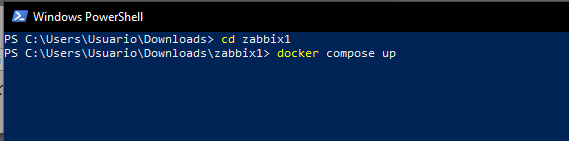

# MANUAL DE DESPLIEGUE PROYECTO DIPLOMADO DEVOPS UNIMINUTO 2023-01

Este documento ha sido creado para proporcionar a los equipos de desarrollo y operaciones una guía completa y detallada sobre el proceso de despliegue de este proyecto sobre la integración de herramientas Api Blockchain, IDS Snort-Snorby y monitoreo Zabbix, utilizando metodologías y prácticas de DevOps. Este manual abordará los conceptos fundamentales de DevOps, proporcionando una visión general de los principios y prácticas que lo respaldan. Además, presentaremos un enfoque paso a paso para el despliegue de proyectos utilizando herramientas y técnicas modernas.  
 

El objetivo final de este manual es proporcionar conocimientos necesarios para implementar un flujo de trabajo de desarrollo y despliegue continuo, permitiendo entregar rápidamente software de calidad a usuarios finales. Es importante destacar que este manual asume un conocimiento básico de desarrollo de software, sistemas operativos y herramientas de automatización.

## Despliegue - API Blockchain

Proyecto desarrollado para lograr desarrollar una aplicación con una arquitectura de aplicación distribuida o arquitectura de microservicios. Donde este corresponde al backend. Con el objetivo de generar transacción y poder ver los registros correspondientes.

# Documentación proyecto
La documentación del proyecto en general la puedes encontrar en: [documentación](https://github.com/mninoquitian/Proyecto-Diplomado/tree/master/Documentacion)

# Requisitos previos

Para poder compilar localmente este proyecto debes tener previamente instalado python.

Primero clona el proyecto: `https://github.com/miguelangel6969/Diplomado-Backend.git`

Se recomienda crear un ambiente virtual de python:

`python -m venv nombre_del_ambiente`

Luego de tener el ambiente se deberan instalar las librerias las cuales se encuentran en el archivo de requerimientos el cual se encuentra en la ruta: `app/requirements.` Para ejecutar este se debera de poner el siguiente código:

`pip install -r requirements.txt`

Esto instalara todas las librerias las cuales necesita la aplicación. Si no se quiere crear un entorno virtual se deberan isntalar las librerias de igual forma.

# Estructura del proyecto

`/app:` Contiene el código fuente y demás carpetas del proyecto
 - `app.py:` Archivo principal proyecto. en el cual se hace la configuración del mismo y se ejecuta.
 - `security.py:` Contiene metodos para validar usuarios y así generar token JWT

`/app/src:` contiene distribución de carpetas para la distibución de código.
  - `../models:` Se crean archivos .py con clases para realizar operaciones de búsqueda, guardado y eliminación en modelos SQLAlchemy
  - `../routes:` Se crean archivos .py con la logica de los servicios a utilizar con sus respectivas rutas
  - `../routes:` Se crean archivos .py con clases que se utilizan para definir un esquema de serialización y deserialización para los modelos
  - `../settings:`  se definen varios atributos de la clase que representan diferentes variables de entorno obtenidas del archivo .env. Estas variables de entorno incluyen configuraciones relacionadas con tokens JWT, configuraciones de base de datos, configuraciones de SQLAlchemy, modo de depuración, clave secreta JWT y otros
  - `db.py:` Se utiliza posteriormente para interactuar con la base de datos, realizar consultas y manipular objetos de modelo.

# Despliegue mediante Docker

- Ubiquese en la ruta `/app`
- Verifique su conexión a internet
- Verifique tener instalado docker en Su maquina. En caso de se debera instalar
- corra el siguiente comando `docker-compose up` esto se encargara de bajar las imagenes requeridas y de crear una red para estas. Una vez haya creado los debidos contenedores de las imagenes pondra a correr estos mismos y podra interactuar con la app.

## Despliegue IDS 

1. Descargar el Zip del IDS y descomprimirlo.
1. Abrir un CMD y realizar un CD para dirigirse a la carpeta.
1. Escribir “Docker Compose up” para cargar todas las imágenes y esperar que termine de ejecutar y salga el PID con el cerdo al final.

1. ` `Presionar CTRL + C una vez, para terminar el proceso.
1. Volver a escribir “Docker Compose up”, ya que en este nuevo inicio se creará automáticamente las tablas para Snorby
1. Ahora dirigirse a la carpeta var/log/snort dentro los archivos del Docker y borrar el archivo barnyard2.waldo

1. Dar clic en el botón de Restart

1. Ahora ve a la carpeta docker/rules y busca el archivo local.rules,  en el editor integrado de docker desktop pega las reglas que necesites para el monitoreo y guarda los cambios.

 

1. Aplica el ultimo Restart y ya queda listo tu IDS.

Zabbix se considera como una herramienta de Sistema de Monitorización de Redes creado por Alexei Vladishev. Está diseñado para monitorizar y registrar el estado de varios servicios de red, Servidores, y hardware de red Usa MySQL.

**INSTALACION**

1. Para instalar Docker en Windows se debe ingresar a:

https://docs.docker.com/docker-for-windows/install/#download-docker-for-windows

1. Haga doble clic en Docker para Windows Installer.exe para ejecutar el instalador.
1. Siga el asistente de instalación para aceptar la licencia, autorizar el instalador y continuar con la instalación.
1. Haga clic en Finalizar en el cuadro de diálogo de configuración completa para abrir Docker.

**Después de tener el Docker instalado procedemos a instalar zabbix en modo Docker compose**

**Manual de instalación Docker con zabbix** 

1. **Dentro de descargas de Windows, cree una carpeta llamada ZABBIX1 (o el nombre de su preferencia)**

1. **En Windows busque el programa bloc de notas**

1.  **Copiar y pegar el siguiente texto:**

**version: '3.5'**

**services:**

**server:**

**image: zabbix/zabbix-server-pgsql:alpine-5.4-latest**

**ports:**

**\- "10051:10051"**

**volumes:**

**\- /etc/localtime:/etc/localtime:ro**

**\- /etc/timezone:/etc/timezone:ro**

**\- ./zbx\_env/usr/lib/zabbix/alertscripts:/usr/lib/zabbix/alertscripts:ro**

**\- ./zbx\_env/usr/lib/zabbix/externalscripts:/usr/lib/zabbix/externalscripts:ro**

**\- ./zbx\_env/var/lib/zabbix/export:/var/lib/zabbix/export:rw**

**\- ./zbx\_env/var/lib/zabbix/modules:/var/lib/zabbix/modules:ro**

**\- ./zbx\_env/var/lib/zabbix/enc:/var/lib/zabbix/enc:ro**

**\- ./zbx\_env/var/lib/zabbix/ssh\_keys:/var/lib/zabbix/ssh\_keys:ro**

**\- ./zbx\_env/var/lib/zabbix/mibs:/var/lib/zabbix/mibs:ro**

**\- ./zbx\_env/var/lib/zabbix/snmptraps:/var/lib/zabbix/snmptraps:ro**

**restart: always**

**depends\_on:**

**\- postgres-server**

**environment:**

**\- POSTGRES\_USER=zabbix**

**\- POSTGRES\_PASSWORD=zabbix**

**\- POSTGRES\_DB=zabbixNew**

**\- ZBX\_HISTORYSTORAGETYPES=log,text #Zabbix configuration variables**

**\- ZBX\_DEBUGLEVEL=1**

**\- ZBX\_HOUSEKEEPINGFREQUENCY=1**

**\- ZBX\_MAXHOUSEKEEPERDELETE=5000**

**\- ZBX\_PROXYCONFIGFREQUENCY=3600**

**web-nginx-pgsql:**

**image: zabbix/zabbix-web-nginx-pgsql:alpine-5.4-latest**

**ports:**

**\- "8080:8080"**

**\- "8443:8443"**

**volumes:**

**\- /etc/localtime:/etc/localtime:ro**

**\- /etc/timezone:/etc/timezone:ro**

**\- ./zbx\_env/etc/ssl/nginx:/etc/ssl/nginx:ro**

**\- ./zbx\_env/usr/share/zabbix/modules/:/usr/share/zabbix/modules/:ro**

**healthcheck:**

**test: \["CMD", "curl", "-f", "http://localhost:8080/"\]**

**interval: 10s**

**timeout: 5s**

**retries: 3**

**start\_period: 30s**

**sysctls:**

**\- net.core.somaxconn=65535**

**restart: always**

**depends\_on:**

**\- server**

**\- postgres-server**

**environment:**

**\- POSTGRES\_USER=zabbix**

**\- POSTGRES\_PASSWORD=zabbix**

**\- POSTGRES\_DB=zabbixNew**

**\- ZBX\_SERVER\_HOST=server**

**\- ZBX\_POSTMAXSIZE=64M**

**\- PHP\_TZ=Europe/Moscow**

**\- ZBX\_MAXEXECUTIONTIME=500**  
\*\*

**agent:**

**image: zabbix/zabbix-agent:alpine-5.4-latest**

**ports:**

**\- "10050:10050"**

**volumes:**

**\- /etc/localtime:/etc/localtime:ro**

**\- /etc/timezone:/etc/timezone:ro**

**\- ./zbx\_env/etc/zabbix/zabbix\_agentd.d:/etc/zabbix/zabbix\_agentd.d:ro**

**\- ./zbx\_env/var/lib/zabbix/modules:/var/lib/zabbix/modules:ro**

**\- ./zbx\_env/var/lib/zabbix/enc:/var/lib/zabbix/enc:ro**

**\- ./zbx\_env/var/lib/zabbix/ssh\_keys:/var/lib/zabbix/ssh\_keys:ro**

**privileged: true**

**pid: "host"**

**restart: always**

**depends\_on:**

**\- server**

**environment:**

**\- ZBX\_SERVER\_HOST=server**  
\*\*

**snmptraps:**

**image: zabbix/zabbix-snmptraps:alpine-5.4-latest**

**ports:**

**\- "162:1162/udp"**

**volumes:**

**\- ./snmptraps:/var/lib/zabbix/snmptraps:rw**

**restart: always**

**depends\_on:**

**\- server**

**environment:**

**\- ZBX\_SERVER\_HOST=server**  
\*\*

**postgres-server:**

**image: postgres:13-alpine**

**volumes:**

**\- ./zbx\_env/var/lib/postgresql/data:/var/lib/postgresql/data:rw**

**\- ./.ZBX\_DB\_CA\_FILE:/run/secrets/root-ca.pem:ro**

**\- ./.ZBX\_DB\_CERT\_FILE:/run/secrets/server-cert.pem:ro**

**\- ./.ZBX\_DB\_KEY\_FILE:/run/secrets/server-key.pem:ro**

**environment:**

**\- POSTGRES\_PASSWORD=zabbix**

**\- POSTGRES\_USER=zabbix**

**\- POSTGRES\_DB=zabbixNew**

**healthcheck:**

**test: \["CMD-SHELL", "pg\_isready"\]**

**interval: 10s**

**timeout: 5s**

**retries: 5**  
\*\*

\*\*

1. **Luego de Haber pegado el texto, dar click en archivo, guardar como, del programa bloc de notas.**

1. **Guardar en la ruta de la carpeta antes creada: Descargas/zabbix1, guardarlo con el nombre  docker-compose.yaml, clic en guardar.**

1. **Diríjase de nuevo al buscador de Windows y abra otro bloc de notas**
1. **En este bloc de notas pegue el siguiente texto:**

**“Este bloc de notas nos servirá para darle un usuario y una contraseña a nuestra base de datos”**

**# zabbix-compose**

**USER=Admin**

**PASSWORD=Zabbix**

1. **Luego de Haber pegado el texto, dar click en archivo, guardar como, del programa bloc de notas.**

1. Guarde el nombre del archivo de la siguiente manera **README.md y guárdelo en la misma carpeta ZABBIX1**

1. **Después de a ver culminado la creación de los archivos deben quedar de esta manera**

1. **Abra la línea de comandos POWER SHELL** 

1. **Diríjase a la siguiente ruta como se evidencia en la imagen:**

** 

1. **Cuando se encuentre en la ruta anterior ejecute el siguiente comando, Docker compose up**

1. **Se comenzará a realizar la instalación de cada uno de los contenedores, el de zabbix, bases de datos posgrest de sql, agente zabbix**

1. **Después de que haya culminado la instalación, diríjase al Docker para verificar, todas las imágenes se encuentre arriba como se evidencia en la imagen.**

1. **Después de verificar que todo este arriba, diríjase a un navegador de su preferencia, en este caso yo escogeré Google.com **

1. **Abra el navegador y pegue el siguiente link [http://localhost:8080/index.php**](http://localhost:8080/index.php)**

1. **Lo llevara a una pagina principal** 

1. **El usuario es Admin y la contraseña es zabbix**
1. **Ingresaran a un inicio de sesión de estos**

