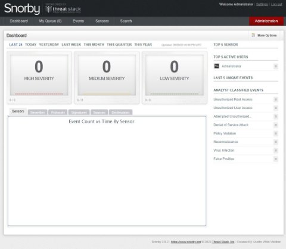
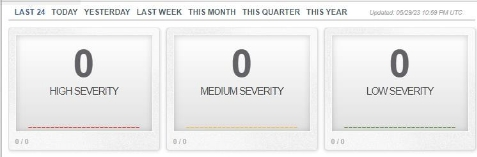

[Documentación del Blockchain	2](#_bookmark0)

[Introducción	2](#_bookmark1)

[Funcionalidades	2](#_bookmark2)

[Login y creación de usuario	2](#_bookmark3)

[Consulta de saldo	3](#_bookmark4)

[Consulta de transacciones	3](#_bookmark5)

[Generar transacción	4](#_bookmark6)

[Configuración del Blockchain	4](#_bookmark7)

[Backend y base de datos	4](#_bookmark8)

[Documentación de Snort, Snorby y Zabbix	5](#_bookmark9)

[Snort	5](#_bookmark10)

[Introducción	5](#_bookmark11)

[Instalación y Configuración	5](#_bookmark12)

[Paso a paso	5](#_bookmark13)

[Uso básico	6](#_bookmark14)

[Snorby	7](#_bookmark15)

[Introducción	7](#_bookmark16)

[Instalación y Configuración	7](#_bookmark17)

[Uso básico	7](#_bookmark18)

[Paso a paso	7](#_bookmark19)

[Zabbix	10](#_bookmark20)

[Introducción	10](#_bookmark21)

[Instalación y Configuración	10](#_bookmark22)

[Uso básico	10](#_bookmark23)

[Monitoreo y análisis de tráfico	11](#_bookmark24)

# Documentación del Blockchain

## Introducción
El Blockchain es una tecnología de registro distribuido que permite la creación y el mantenimiento de una base de datos segura y transparente. En este documento, se describe el Blockchain desarrollado en Python para el backend y Angular para el frontend, con una base de datos SQL Server.

# Funcionalidades
## Login y creación de usuario
El Blockchain cuenta con un sistema de autenticación que permite a los usuarios registrarse y acceder a sus cuentas. Para iniciar sesión, el usuario deberá proporcionar su nombre de usuario y contraseña. En caso de no tener una cuenta, se le proporcionará la opción de crear una nueva.

## Consulta de saldo
Una vez que el usuario haya iniciado sesión, podrá realizar consultas sobre su saldo actual en la plataforma. El saldo representa la cantidad de fondos disponibles en la cuenta del usuario en el Blockchain.

## Consulta de transacciones
El Blockchain también ofrece la funcionalidad de consultar las transacciones realizadas por el usuario. Estas transacciones incluyen tanto los envíos como las recepciones de fondos. Cada transacción mostrará la fecha, el monto y los detalles de la operación.

## Generar transacción
El usuario podrá generar nuevas transacciones a través del Blockchain. Al seleccionar esta opción, se le pedirá que indique el monto de la transacción que desea realizar. El sistema verificará si el usuario tiene fondos suficientes y le mostrará una lista de usuarios registrados en el sistema para seleccionar al destinatario de la transacción.

# Configuración del Blockchain
El Blockchain está configurado utilizando Docker, lo que facilita su implementación y despliegue. A continuación, se muestran las líneas de código del archivo **docker-compose.yml** para cada uno de los servicios involucrados:

## Backend y base de datos

En el bloque de código anterior, se definen tres servicios: **midb**, **miback** y **mifront**. El servicio **midb** representa la base de datos SQL Server utilizada por el backend. El servicio **miback** representa el backend desarrollado en Python y el servicio mifront representa el frontend desarrollado en Angular. Cada servicio se configura con sus respectivos puertos y dependencias.

# Documentación de Snort, Snorby y Zabbix

## Snort

### Introducción
Snort es un sistema de detección y prevención de intrusiones de código abierto. Se utiliza para monitorear y analizar el tráfico de red en busca de posibles amenazas y ataques. Esta documentación proporciona una visión general de Snort y los pasos básicos para su configuración y uso.
### Instalación y Configuración
- Descarga de Snort: Visita el sitio web oficial de Snort y descarga la última versión estable de Snort para tu sistema operativo.
- Instalación de dependencias: Asegúrate de tener las dependencias necesarias, como libpcap, libdnet y libpcre, instaladas en tu sistema.
- Configuración del archivo de reglas: Crea un archivo de reglas personalizado o utiliza reglas predefinidas disponibles en línea. Especifica los patrones y comportamientos que Snort buscará en el tráfico de red.
- Configuración de Snort: Crea un archivo de configuración de Snort (snort.conf) donde se especifiquen las opciones y ajustes necesarios. Incluye la ubicación del archivo de reglas y la interfaz de red que Snort debe monitorear.
- Ejecución de Snort: Utiliza el comando snort -c snort.conf -i <interfaz> para iniciar Snort. Reemplaza <interfaz> con el nombre de la interfaz de red que deseas monitorear.
### Paso a paso
1. **Actualiza los repositorios del sistema:**

   0. sudo apt update
1. **Instala las dependencias necesarias:**

   0. sudo apt install -y build-essential libpcap-dev libpcre3-dev libdumbnet-dev bison flex zlib1g-dev liblzma-dev openssl libssl-dev ethtool
1. **Descarga el código fuente de Snort desde el sitio oficial:**

   0. wget https://[www.snort.org/downloads/snort/snort-](http://www.snort.org/downloads/snort/snort-)<version>.tar.gz
   0. Reemplaza **<version>** con la versión deseada.
1. **Extrae el archivo comprimido:**

   0. tar -xvf snort-<version>. tar.gz
1. **Navega al directorio del código fuente de Snort:**

   0. cd snort-<version>

1. **Configura y compila Snort:**

0. . /configure --enable-sourcefire
0. make sudo
0. make install
1. **Crea el directorio para los archivos de configuración:**

   0. sudo mkdir /etc/snort
1. **Copia los archivos de configuración predeterminados al directorio creado:**

   0. sudo cp etc/\* /etc/snort/
1. **Descarga las reglas actualizadas de Snort:**

   0. sudo	wget	https://[www.snort.org/downloads/community/community-](http://www.snort.org/downloads/community/community-) rules.tar.gz
1. **Extrae las reglas descargadas:**

   0. sudo tar -xvf community-rules.tar.gz -C /etc/snort/rules
1. **Configura la interfaz de red en la que Snort debe monitorear el tráfico:**

   0. sudo vi /etc/snort/snort.conf
1. **Inicia Snort para probar su funcionamiento:**

   0. sudo snort -A console -q -u snort -g snort -c /etc/snort/snort.conf Esto iniciará Snort en modo consola con la configuración especificada.

### Uso básico
- Monitoreo de eventos: Snort comenzará a monitorear el tráfico en la interfaz especificada y generará eventos cuando detecte posibles amenazas o actividades sospechosas. Puedes ver los eventos en tiempo real o almacenarlos en un archivo de registro para su posterior análisis.

## Snorby
### Introducción
Snorby es una interfaz web que proporciona una plataforma para administrar y analizar los eventos generados por Snort. Permite visualizar, filtrar y analizar los eventos de manera conveniente. Esta documentación te guiará a través de los pasos básicos para la configuración y uso de Snorby.

### Instalación y Configuración
- Descarga de Snorby: Visita el repositorio de Snorby en GitHub y descarga la última versión estable de Snorby.
- Configuración de la base de datos: Instala y configura una base de datos compatible, como MySQL o PostgreSQL, para almacenar los datos de Snorby.
- Configuración de Snorby: Copia el archivo de configuración de ejemplo (snorby\_config.yml.example) y renómbralo como snorby\_config.yml. Edita este archivo y proporciona los detalles de configuración necesarios, como la información de la base de datos.
### Uso básico
- Inicio de Snorby: Utiliza el comando rails server para iniciar el servidor de Snorby. Esto permitirá el acceso a la interfaz web de Snorby.
- Acceso a la interfaz web: Abre un navegador web y navega a la dirección http://localhost:3000 (o la dirección correspondiente si has configurado un puerto diferente). Esto te llevará a la interfaz de usuario de Snorby.
- Visualización de eventos: En la interfaz de Snorby, podrás ver una lista de eventos generados por Snort. Utiliza las diferentes opciones de filtrado y búsqueda para explorar y analizar los eventos de manera eficiente.
### Paso a paso
1. Preparación del entorno:

   0. Asegúrate de tener Ruby y Rails instalados en tu sistema. Puedes verificar su presencia ejecutando los siguientes comandos:

      0. ruby -v
      0. rails –v
   0. Instala las dependencias necesarias, como MySQL o PostgreSQL, y configura una base de datos para Snorby.
1. **Descarga e instala Snorby:**

   0. Clona el repositorio de Snorby desde GitHub:

      0. git clone https://github.com/Snorby/snorby.git
   0. Navega al directorio del proyecto Snorby:

      0. cd snorby
   0. Instala las gemas (paquetes de Ruby) requeridas:

      0. bundle install
   0. Copia el archivo de configuración de ejemplo y renómbralo:

      0. cp config/snorby\_config.yml.example config/snorby\_config.yml
   0. Abre el archivo snorby\_config.yml y configura la información de la base de datos y otros ajustes según tu entorno.

1. **Configuración adicional:**

0. Configura el servidor web para servir la aplicación Snorby. Puedes utilizar Apache o Nginx como servidor web y configurar un proxy inverso hacia Snorby.
0. Configura los trabajadores de fondo (background workers) para el procesamiento de tareas en segundo plano de Snorby. Puedes utilizar herramientas como Sidekiq para esto.
1. **Ejecuta Snorby:**

   0. Inicia la aplicación Snorby:

      0. rails server
   0. Accede	a	Snorby	a	través	de	tu	navegador	web	en	la	dirección

**http://localhost:3000** (o la dirección correspondiente según tu configuración).

0. Una vez en la dirección, nos aparecerá un login básico para iniciar sesión, ingresamos el usuario correspondiente.

- Nos aparece el home con un dashboard, el cual contendra la información de las solicitudes que sean realizadas al blockchain, hay que tener en cuenta, que solo se rastrearan las solicitudes que sean configuradas por medio de las reglas en el snort
- EL Home Dashboard de Snorby es la página principal de la interfaz de usuario de Snorby, donde se muestra un resumen y una visión general de los eventos y actividades de seguridad detectados por Snort. Proporciona una instantánea rápida y fácilmente legible del estado de seguridad de tu red.

1. #### **Home Dashboard de Snorby suele incluir los siguientes elementos:**

- Resumen de eventos: En la parte superior del dashboard, se muestra un resumen de eventos recientes y relevantes, como el número total de eventos, eventos clasificados como ataques, eventos de alta prioridad, etc. Esto te permite tener una idea general de la actividad de seguridad en tu red.

- Gráficos e indicadores: El Home Dashboard puede incluir gráficos y visualizaciones que representan estadísticas y tendencias clave, como el volumen de eventos en el tiempo, los protocolos más frecuentes involucrados en los eventos, los ataques más comunes, etc. Estos gráficos ayudan a identificar patrones y áreas de enfoque.

- Tablas y listas de eventos: Snorby muestra una tabla o lista de eventos recientes, generalmente ordenados por fecha y hora. Esta lista puede incluir detalles como la dirección IP de origen y destino, los protocolos utilizados, las firmas asociadas, la gravedad del evento, etc. Esta información permite un análisis más detallado de los eventos.

- Alertas y notificaciones: Si se han configurado reglas de alerta o umbrales específicos, el Home Dashboard puede mostrar alertas y notificaciones destacadas. Estas alertas pueden indicar eventos críticos o violaciones de seguridad que requieren una atención inmediata.

- Enlaces rápidos: El Home Dashboard puede proporcionar enlaces rápidos a otras secciones importantes de Snorby, como la configuración, los informes generados y las páginas de búsqueda avanzada. Estos enlaces facilitan la navegación y el acceso a funciones adicionales de Snorby.

## Zabbix
### Introducción
Zabbix es una plataforma de supervisión y registro de red que permite monitorear el estado de los servicios, servidores y hardware de red en tiempo real. Esta documentación proporcionará una descripción general de Zabbix y los pasos básicos para su configuración y uso.
### Instalación y Configuración
- Descarga de Zabbix: Visita el sitio web oficial de Zabbix y descarga la última versión estable de Zabbix para tu sistema operativo.
- Configuración del servidor Zabbix: Sigue las instrucciones de instalación proporcionadas en la documentación oficial de Zabbix para configurar y ejecutar el servidor Zabbix. Esto incluye la configuración de la base de datos y la interfaz web de administración.
- Instalación del agente Zabbix: Para monitorear los dispositivos y servicios, instala el agente Zabbix en los sistemas que deseas supervisar. El agente recopilará los datos y los enviará al servidor Zabbix.
### Uso básico
- Visualización de datos: Accede a la interfaz web de Zabbix para ver los datos y estadísticas recopilados. Puedes explorar diferentes paneles, gráficos y vistas para obtener información sobre el estado de tus servicios y dispositivos.

- Configuración de alertas: Configura las notificaciones y alertas en Zabbix para recibir avisos cuando se detecten problemas o se superen ciertos umbrales de rendimiento.
- Generación de informes: Utiliza las funciones de generación de informes de Zabbix para obtener informes detallados sobre el rendimiento y la disponibilidad de tus sistemas.

Si queremos omitir los pasos anteriores, simplemente podemos procesar nuestro archivo “docker-compose.yml” con el comando “docker-compose up -d”, ya que en estas imágenes se tiene configurado todo lo necesario para el correcto funcionamiento de ambas herramientas.

# Monitoreo y análisis de tráfico
En el bloque de código anterior, se definen los servicios necesarios para el monitoreo y análisis de tráfico. El servicio **db** representa la base de datos MySQL utilizada por **Snorby**. El servicio **adminer** proporciona una interfaz web para administrar la base de datos. El servicio **snorby** representa la

aplicación **Snorby**, utilizada para el análisis de tráfico y protocolos de red. El servicio ids utiliza la imagen de Docker para **Snort** IDS, que permite la detección y prevención de ciberataques.
